# 이미지 업로드 프로세스 플로우

## 관련 함수 바로가기

📄 **ImageUploader.tsx**:

- [`handleFileChange`](../../components/ImageUploader.tsx#L76)
- [`handleImageRemove`](../../components/ImageUploader.tsx#L150)

📄 **useImageUpload.ts**:

- [`validateImage`](../../hooks/useImageUpload.ts#L87)
- [`compressImage`](../../hooks/useImageUpload.ts#L34)
- [`uploadImage`](../../hooks/useImageUpload.ts#L61)
- [`useImageUpload`](../../hooks/useImageUpload.ts#L150)

## 프로세스 플로우 다이어그램



```mermaid
flowchart TD
    A[Start] --> B{"Select Image<br><input onChange={handleFileChange}"}

    subgraph Hook["useImageUpload Hook"]
        B --> C["Validate Image<br>validateImage(file)"]

        C --> D{"Check File Type<br>validImageTypes.includes(file.type)"}
        D -->|"Invalid"| E["Show Error Toast<br>toast({ variant: 'destructive' })"]

        D -->|"Valid"| F{"Check File Size<br>file.size > maxUploadSizeMB"}
        F -->|"Too Large"| G["Show Error Toast<br>toast({ variant: 'destructive' })"]

        F -->|"OK"| H["Start Loading<br>setIsLoading(true)"]

        H --> I["Compress Image<br>compressImage(file, options)"]
        I --> J["Create Preview<br>URL.createObjectURL()<br>setPreviewUrl()"]

        J --> K["Upload to Server<br>uploadImage(compressedFile)"]

        K --> L{"Upload Success?"}
        L -->|"Yes"| M["Success Handler<br>onUploadSuccess(url)<br>toast('success')"]
        L -->|"No"| N["Error Handler<br>onUploadError(error)<br>toast('error')"]

        M --> O["Return URL"]
        N --> P["Remove Preview<br>handleImageRemove()<br>URL.revokeObjectURL()"]
    end

    E --> B
    G --> B
    O --> Q[End]
    P --> B

    style A fill:#f9f,stroke:#333
    style Q fill:#f9f,stroke:#333
    style E fill:#faa,stroke:#333
    style G fill:#faa,stroke:#333
    style N fill:#faa,stroke:#333
    style M fill:#afa,stroke:#333
    style Hook fill:#eef,stroke:#333

    classDef functionBlock fill:#e1f5fe,stroke:#333
    class C,I,J,K functionBlock
```

## 주요 함수 설명

### 컴포넌트 레벨 함수

#### [`handleFileChange`](command:_typescript.goToSourceDefinition?["handleFileChange"])

```typescript
const handleFileChange = async (e: React.ChangeEvent<HTMLInputElement>) => {
  const file = e.target.files?.[0];
  if (file) {
    await handleImageSelect(file);
  }
};
```

파일 입력 이벤트를 처리하고 이미지 업로드 프로세스를 시작합니다.

### 유틸리티 함수

#### [`validateImage`](command:_typescript.goToSourceDefinition?["validateImage"])

```typescript
const validateImage = (file: File): boolean => {
  // 파일 타입과 크기 검증
  ...
};
```

업로드된 이미지의 유효성을 검사합니다.

#### [`compressImage`](command:_typescript.goToSourceDefinition?["compressImage"])

```typescript
const compressImage = async (
  file: File,
  options: { maxSizeMB: number; maxWidthOrHeight: number }
): Promise<File> => {
  // 이미지 압축 로직
  ...
};
```

이미지를 지정된 크기로 압축합니다.

#### [`uploadImage`](command:_typescript.goToSourceDefinition?["uploadImage"])

```typescript
const uploadImage = async (file: File): Promise<string> => {
  // 서버 업로드 로직
  ...
};
```

압축된 이미지를 서버에 업로드합니다.

#### [`handleImageRemove`](command:_typescript.goToSourceDefinition?["handleImageRemove"])

```typescript
const handleImageRemove = (): void => {
  // 이미지 제거 및 정리 로직
  ...
};
```

이미지와 관련 리소스를 정리합니다.

### 메인 훅

#### [`useImageUpload`](command:_typescript.goToSourceDefinition?["useImageUpload"])

이미지 업로드 관련 모든 로직을 관리하는 커스텀 훅입니다.

## 파일 구조

- 📁 components
  - 📄 [ImageUploader.tsx](command:_typescript.goToSourceDefinition?["ImageUploader"])
- 📁 hooks
  - 📄 [useImageUpload.ts](command:_typescript.goToSourceDefinition?["useImageUpload"])

## 사용 방법

VS Code에서:

1. 함수 이름을 클릭하면 해당 함수의 정의로 이동합니다.
2. 파일 이름을 클릭하면 해당 파일이 열립니다.
3. `Ctrl`/`Cmd` + 클릭으로도 이동 가능합니다.

## 참고사항

- 이 문서의 링크 기능은 VS Code에서만 작동합니다.
- GitHub 등에서 볼 때는 일반 텍스트로 표시됩니다.
- 프로젝트가 VS Code workspace에 올바르게 설정되어 있어야 합니다.
