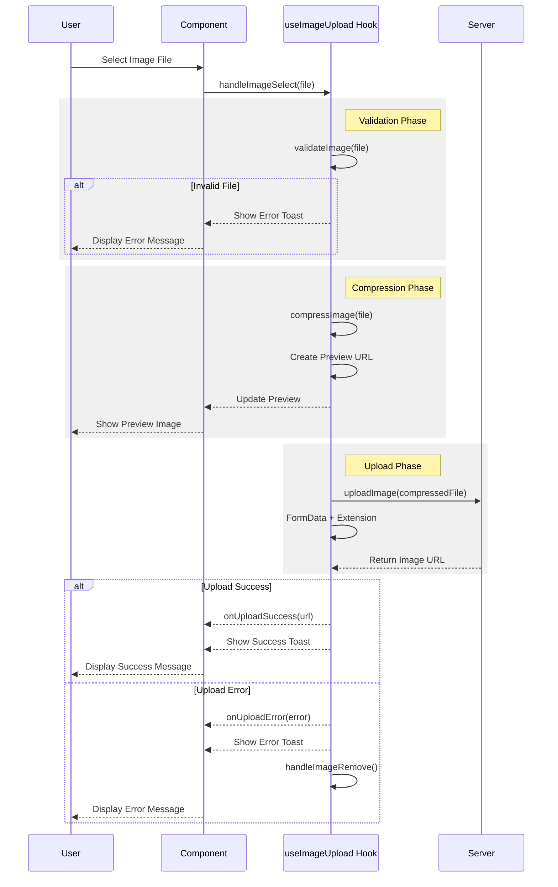

# Image Upload Sequence Diagram

이미지 업로드 프로세스의 컴포넌트 간 상호작용을 보여주는 시퀀스 다이어그램입니다.

```mermaid
sequenceDiagram
    participant U as User
    participant C as Component
    participant H as useImageUpload Hook
    participant S as Server

    U->>C: Select Image File
    C->>H: handleImageSelect(file)

    rect rgb(240, 240, 240)
        Note right of H: Validation Phase
        H->>H: validateImage(file)
        alt Invalid File
            H-->>C: Show Error Toast
            C-->>U: Display Error Message
        end
    end

    rect rgb(240, 240, 240)
        Note right of H: Compression Phase
        H->>H: compressImage(file)
        H->>H: Create Preview URL
        H-->>C: Update Preview
        C-->>U: Show Preview Image
    end

    rect rgb(240, 240, 240)
        Note right of H: Upload Phase
        H->>S: uploadImage(compressedFile)
        H->>H: FormData + Extension
        S-->>H: Return Image URL
    end

    alt Upload Success
        H-->>C: onUploadSuccess(url)
        H-->>C: Show Success Toast
        C-->>U: Display Success Message
    else Upload Error
        H-->>C: onUploadError(error)
        H-->>C: Show Error Toast
        H->>H: handleImageRemove()
        C-->>U: Display Error Message
    end
```
